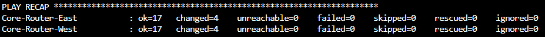
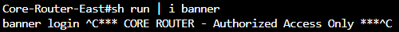
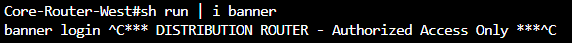
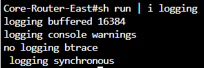
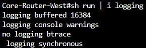
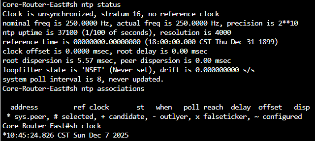
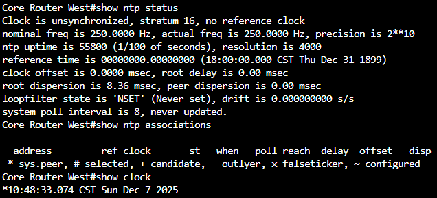

# ansible-assignment-3
Ansible Playbook Assignment 3 for CNIT-381

## Description of Playbook
The following playbook will configure both routers as an NTP client to Google's time server. The timezone will also be set to CST. Next, logging will be configured on both routers. Finally, a banner is assigned to the routers. The East router will be assigned a core router banner, while the West router will be assigned a distribution router banner. 

## Instructions to Run
Run the following command: ```ansible-playbook -i inventory.ini assignment3.yaml```

## Screenshot of Successful Execution
### Successful Playbook Execution


### Verification of Configured Banner
#### Core-Router-East

#### Core-Router-West


### Verification of Logging Configuration
#### Core-Router-East

#### Core-Router-West


### Verification of Time Configuration
#### Core-Router-East

#### Core-Router-West


Note: The routers cannot reach Google's Time Server (no internet connectivity) so the show ntp commands will state that the router's clock is unsynchonized. 